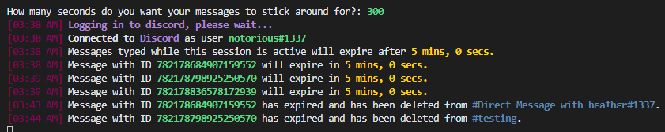

# Self-Destructing-Discord-Messages
 Simple script that self-deletes messages on Discord using message.edit and delete_after from discord.py. Inspired by keybase's exploding messages.
 
 Should be cross-platform for Linux, Windows, and Mac.
 

***
### How to obtain your token
**1.** Press **Ctrl+Shift+I** (⌘⌥I on Mac) on Discord to show developer tools 
**2.** Navigate to the **Application** tab 
**3.** Select **Local Storage** > **https://discordapp.com** on the left 
**4.** Press **Ctrl+R** (⌘R) to reload 
**5.** Find **token** at the bottom and copy the value 
***
### Disclaimer
This is a self-bot which goes against the Discord ToS agreement. Use it at your own risk.
